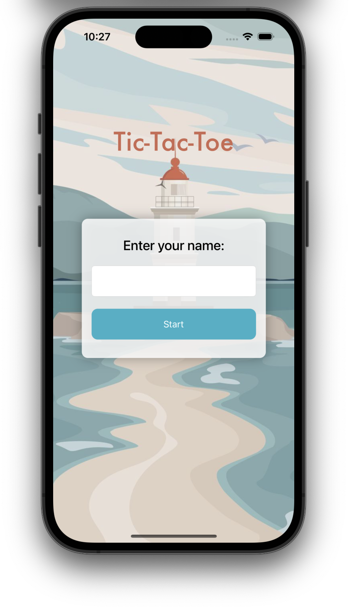
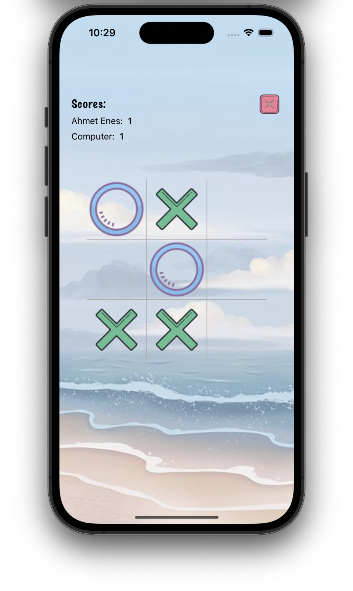

# Tic-Tac-Toe-App
Tic Tac Toe is a classic two-player board game played on a 3x3 grid. The objective of the game is to be the first player to form a line of three of their symbols (either "X" or "O") either horizontally, vertically, or diagonally on the game board.

 You can see the images of the application below.
 
   
